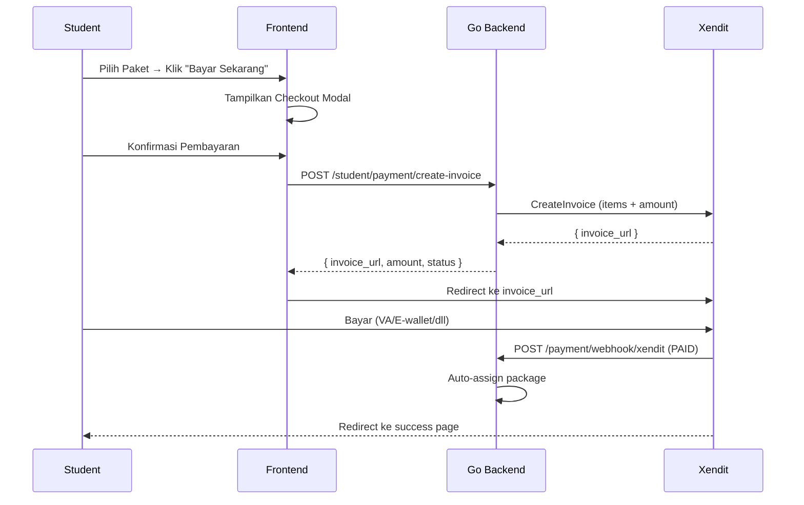

# Xendit Payment Gateway — Walkthrough

## Summary

Replaced manual WhatsApp payment flow with automated Xendit payment gateway. Student selects package → reviews checkout → pays via Xendit → package auto-assigns.

## Backend Changes (Go)

### New Files

| File | Purpose |
|------|---------|
| [payment.go](file:///d:/Project%20Music/madEU/backend/domain/payment.go) | `Payment` model, webhook payload, interfaces |
| [payment.go](file:///d:/Project%20Music/madEU/backend/repository/payment.go) | GORM CRUD operations |
| [payment.go](file:///d:/Project%20Music/madEU/backend/service/payment.go) | Xendit SDK + auto-assign |
| [payment.go](file:///d:/Project%20Music/madEU/backend/delivery/payment.go) | REST handlers + webhook |

### Modified Files

| File | Change |
|------|--------|
| [db.go](file:///d:/Project%20Music/madEU/backend/config/db.go) | Added `Payment` to auto-migration |
| [bootstrap.go](file:///d:/Project%20Music/madEU/backend/bootstrap/bootstrap.go) | Wired payment components |
| [.env](file:///d:/Project%20Music/madEU/backend/.env) | Added `XENDIT_WEBHOOK_TOKEN`, `NEXT_PUBLIC_SITE_URL` |

### API Endpoints

| Method | Path | Auth | Description |
|--------|------|------|-------------|
| `POST` | `/student/payment/create-invoice` | JWT | Creates Xendit invoice |
| `POST` | `/payment/webhook/xendit` | Callback token | Handles payment callbacks |
| `GET` | `/student/payment/history` | JWT | Payment history |

---

## Frontend Changes (Next.js)

### Modified Files

| File | Change |
|------|--------|
| [page.tsx](file:///d:/Project%20Music/madEU/frontend/app/dashboard/panel/student/subscription/page.tsx) | Replaced WhatsApp flow with Xendit checkout modal |

### New Files

| File | Purpose |
|------|---------|
| [success/page.tsx](file:///d:/Project%20Music/madEU/frontend/app/dashboard/panel/student/payment/success/page.tsx) | Payment success redirect |
| [failed/page.tsx](file:///d:/Project%20Music/madEU/frontend/app/dashboard/panel/student/payment/failed/page.tsx) | Payment failure redirect |

### Key UI Changes on Subscription Page

- ❌ Removed: Bank account sidebar, WhatsApp redirect, manual payment message
- ✅ Added: Checkout confirmation modal with price breakdown  
- ✅ Added: "Bayar Sekarang" button → calls backend → redirects to Xendit
- ✅ Added: Fee summary sidebar (Registrasi + SPP + Paket)
- ✅ Added: Xendit security badge

---

## Payment Flow



## Environment Variables

### Backend `.env`
```
XENDIT_SECRET_KEY=xnd_development_...
XENDIT_WEBHOOK_TOKEN=fHoc1Nj...
NEXT_PUBLIC_SITE_URL=http://localhost:3000
```

### Frontend `.env.local`
```
NEXT_PUBLIC_SITE_URL=http://localhost:3000
```

## Verification

- ✅ Backend: `go build ./...` — passed
- ✅ Backend: Server starts with `go run ./app/main.go -mode=no-wa`, `Payment` table migrated
- ⬜ Manual: Create invoice via student login → verify Xendit redirect
